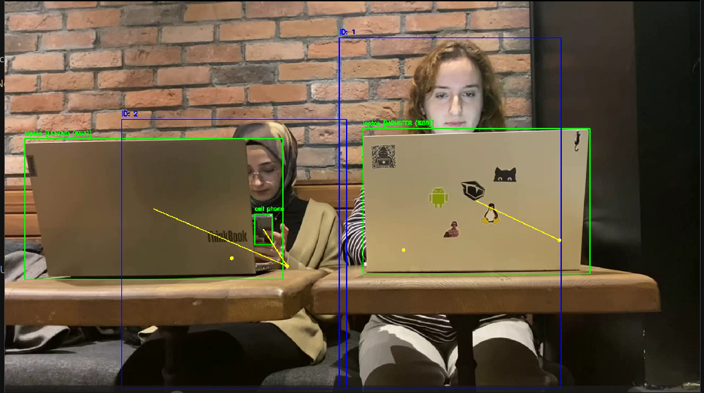
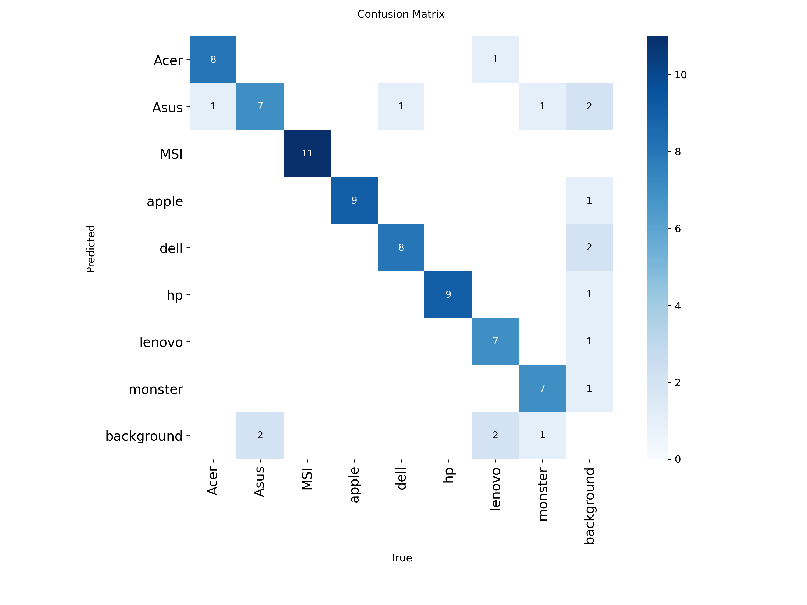

# 👁️ Vision-Based Forensic Analysis System
### Advanced Person-Device Interaction Tracking & Brand Recognition


## 🚀 Overview

This project is a **Computer Vision-based forensic tool** designed to analyze security camera footage in real-time.

In crowded environments (offices, internet cafes, exam centers), it is often difficult to determine **who exactly is using a specific device** just by looking at raw video feeds.

I developed this system to solve this problem by automating the detection of **people, devices, and their physical interactions**. Using state-of-the-art Deep Learning models, the system identifies the specific brand of laptops (e.g., Monster, Lenovo), tracks individuals over time, and verifies "Active Usage" using biomechanical pose estimation.

## 🎯 Key Features

* **👁️ Advanced Object Detection (YOLO11x):** Detects people, laptops, and smartphones with high precision, even in complex scenes.
* **💻 Granular Brand Recognition (Custom YOLOv8m):** Unlike standard models that only detect "laptops", this system identifies specific brands (**Monster, Lenovo, HP, etc.**) to narrow down inventory matching.
* **🦴 Behavioral Interaction Analysis (Pose Estimation):** Uses **YOLOv8-Pose** to analyze wrist keypoints. It distinguishes between a person *just standing near* a device and a person *actively typing* on it.
* **🆔 Continuous Person Tracking (OSNet Re-ID):** Maintains the identity of individuals even if they leave the frame and return, ensuring consistent tracking throughout the video.
* **⚖️ Privacy Preserving:** Automatically blurs faces of detected individuals while keeping the device and interaction data clear for forensic analysis.

## 🛠️ Architecture & Tech Stack

The system operates on a specialized computer vision pipeline:

1.  **Detection Layer:**
    * **YOLO11x:** For high-accuracy generic object detection (Person, Phone, Laptop).
    * **Custom YOLOv8m:** Trained on a custom dataset to classify laptop brands.
2.  **Analysis Layer:**
    * **Pose Estimation:** Extracts skeleton keypoints to calculate the Euclidean distance between **Wrists** and **Devices**.
    * **OSNet (Re-ID):** Generates deep feature embeddings to track unique identities across frames.
3.  **Reporting Layer:**
    * Generates a real-time log of **"Who (Person-ID) used What (Brand-ID) at When (Timestamp)"**.

## 📸 Results

### 1. Brand & Interaction Detection
The system correctly identifies the laptop brand (e.g., "Monster") and verifies that the user is actively interacting with it.
*(Face blurred automatically for privacy)*



### 2. Confusion Matrix (Brand Recognition)
Performance of the custom-trained YOLO model on distinguishing specific laptop brands. It achieves **100% precision** on key brands like Lenovo and Monster in the test set.



## 📂 Project Structure

```text
├── assets/                 # Demo images and results
├── data/                   # Input videos and ground truth labels
│   ├── videos/             
│   └── labels/             
├── models/                 # Custom trained weights (.pt files)
│   └── markaTespit.pt      # My Custom Laptop Brand Model
├── src/                    # Source code (Jupyter Notebooks)
│   └── Forensic_System.ipynb
├── requirements.txt        # Dependencies
└── README.md               # Documentation
